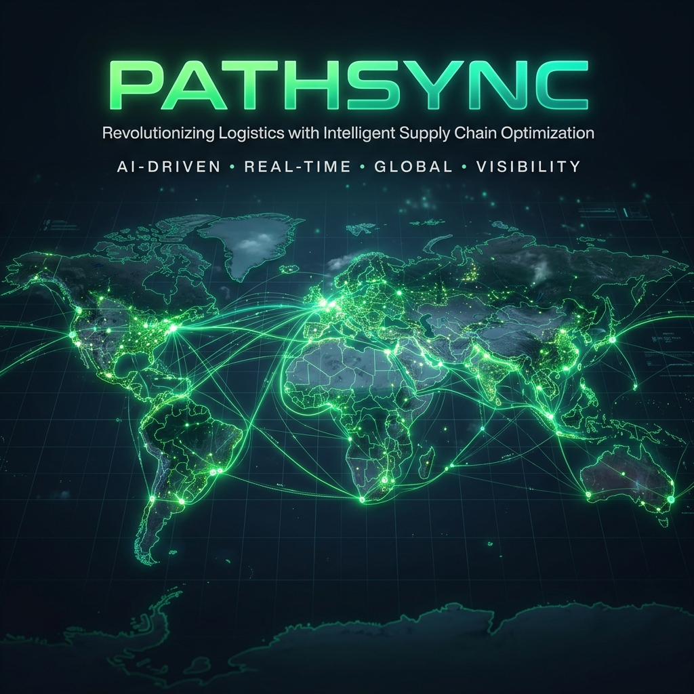

<!-- Header Image -->
<p align="center">
  
</p>

<!-- Title & Tagline -->
<h1 align="center">📍 PathSync</h1>
<p align="center">
  <strong>Next-Generation Logistics Delivery Optimization Engine</strong>
  <br />
  <i>Leveraging graph theory, greedy heuristics, and advanced mathematics to compute real-time, high-efficiency delivery paths.</i>
</p>

<!-- Tech Badges (Shields.io) -->
<p align="center">
  <a href="https://vercel.com">
    
  </a>
  <a href="#">
    
  </a>
  <a href="#">
    
  </a>
  <a href="#">
    
  </a>
  <a href="#">
    
  </a>
</p>

---

## 🌟 Interactive Experience & Micro-Animations

PathSync isn't a static utility app—it's a living, breathing graphical experience designed with **MNC-grade aesthetics** and rich interactive motion:

*   **⚡ Hero Neural Network (vis.js):** At the top of the landing page, a live node-link neural web dynamically pulses traffic payloads along optimized pathways. You can drag, click, and interact with the nodes, with natural-feeling spring physics!
*   **🎭 GreenSock ScrollMagic (GSAP):** Experience elegant entrance transitions. Text elements, feature containers, and the real-time comparison tables slide, scale, and stagger into view smoothly as you scroll.
*   **📊 Live Dual-Axis Scale Plotter (Chart.js):** Benchmark results render dynamically with micro-load animations, plotting sub-millisecond execution times against memory foot-print costs.
*   **🕯️ Glowing Dark-Mode Glassmorphism:** Fully optimized CSS stylesheets (`css/landing.css`) with deep rich blue/black space colors (`#0b1120`), glowing border-radius containers, and high-tech box shadows.

---

## 🚀 Interactive Application Modules

<details open>
  <summary><b>1. 🌐 Delivery Data Collection and Network Modeling</b></summary>
  <p>Allows routing administrators to configure a full network of delivery locations, client addresses, and central hubs.</p>
  <ul>
    <li>Interactive graph visualizations showing hubs (like <i>T Nagar Hub</i>, <i>OMR Tech Park</i>) and delivery locations.</li>
    <li>Real-time node-adding, deleting, and edge-weight modifications.</li>
    <li>Dynamic Toll-Cost calculator (accounting for historical OMR toll-free stretches).</li>
  </ul>
</details>

<details>
  <summary><b>2. ⚡ Route Optimization & Algorithm Solvers</b></summary>
  <p>Features 4 industry-standard graph algorithm models implementing raw computational logistics:</p>
  <table>
    <thead>
      <tr>
        <th>Algorithm</th>
        <th>Visual Color</th>
        <th>Behavior Profile</th>
        <th>Optimization Goal</th>
      </tr>
    </thead>
    <tbody>
      <tr>
        <td><b>Dijkstra</b></td>
        <td>🟢 Emerald Green</td>
        <td>Single-source search</td>
        <td>Shortest route from center hub to destination</td>
      </tr>
      <tr>
        <td><b>A* Search</b></td>
        <td>🔵 Sky Blue</td>
        <td>Heuristic-driven speed</td>
        <td>Ultra-fast target-point routing</td>
      </tr>
      <tr>
        <td><b>Greedy TSP</b></td>
        <td>🟡 Amber Gold</td>
        <td>Multi-stop loop</td>
        <td>Optimal closed path covering all active stops</td>
      </tr>
      <tr>
        <td><b>Prim's MST</b></td>
        <td>🔴 Crimson Red</td>
        <td>Spanning tree</td>
        <td>Connecting nodes with minimum total line network</td>
      </tr>
    </tbody>
  </table>
</details>

<details>
  <summary><b>3. 🚗 Dynamic Dispatch & Connected Intelligence</b></summary>
  <p>Simulate fleet assignments instantly!</p>
  <ul>
    <li><b>Fleet Table:</b> Live dispatch panel tracking drivers, vehicle type (electric vs. truck), and delivery payload.</li>
    <li><b>Real-Time Dispatching:</b> Instantly assign optimal calculated paths to idle drivers, transitioning statuses to <i>"En Route"</i> with live progress tracking logs.</li>
    <li><b>Demand Heatmaps:</b> Visualized hotzones directly map high-demand districts. Clicking a zone auto-fills details to expand your model.</li>
  </ul>
</details>

---

## ⚡ Computational Performance Benchmarks

### Scale Scaling Chart

PathSync executes heavy graph computations completely client-side in sub-millisecond windows. Below is the theoretical algorithmic complexity profile compared inside the engine:

$$\begin{array}{c|c|c}
\text{\bf Algorithm} & \text{\bf Time Complexity} & \text{\bf Space Complexity} \\
\hline
\text{Dijkstra's Shortest Path} & O((V + E) \log V) & O(V) \\
\text{A* Search} & O(b^d) & O(V) \\
\text{Greedy TSP Heuristic} & O(V^2) & O(V) \\
\text{Prim's Minimum Spanning Tree} & O(E \log V) & O(V)
\end{array}$$

*   **V** = Vertices (Delivery points)
*   **E** = Edges (Connected roads)

---

## 💻 Running PathSync Locally

Run PathSync on your local computer instantly with no package dependencies:

1.  **Clone the Repository:**
    ```bash
    git clone https://github.com/Vixcy300/Delivery-Optimizer.git
    cd Delivery-Optimizer
    ```
2.  **Launch a Local Server:**
    ```powershell
    # Using Node.js npx:
    npx http-server -p 3000
    
    # Or using Python:
    python -m http.server 3000
    ```
3.  **Launch Dashboard:** Open `http://localhost:3000` in your web browser.

---

## ☁️ Zero-Config Vercel Deployment

Deploying PathSync to Vercel takes 30 seconds:

1.  Log in to [Vercel](https://vercel.com).
2.  Click **Add New...** -> **Project**.
3.  Import this `Delivery-Optimizer` repository.
4.  Click **Deploy**! Vercel handles the static hosting and serves it at your global URL with automated SSL and edge caching.

---
<p align="center">
  Made with 💚 by the PathSync Logistics Engineering Team.
</p>
